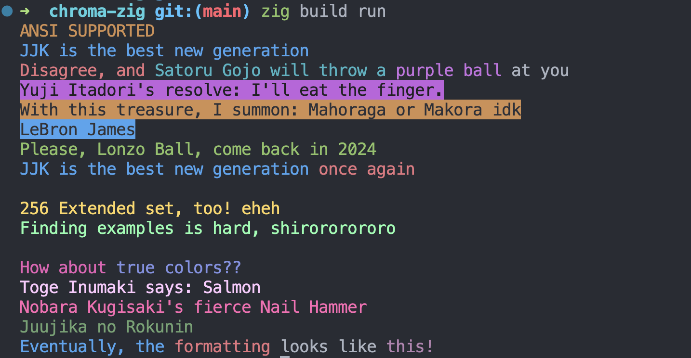

# Use-Chroma Example Application

This example application demonstrates the usage of the Chroma-Zig library, which provides flexible and dynamic string formatting with ANSI color codes. It showcases how to integrate Chroma-Zig into a Zig project to produce colorful terminal output.



## Overview

Use-Chroma leverages the Chroma-Zig library to format strings with various ANSI colors, ANSI 256 extended colors, and true color (24-bit) formats. This application serves as a practical example of how to use Chroma-Zig in your own Zig projects.

The library has been installed leveraging Zig's package manager, you can find more in the [build.zig.zon](build.zig.zon) file.

## Getting Started

To run this example, you will need a Zig compiler version 0.12.0-dev.2701+d18f52197 or newer ([master branch](https://github.com/ziglang/zig)). You can install Zig by following the instructions on the [official website](https://ziglang.org/download/).

### Installation

1. Clone the Use-Chroma repository to your local machine.
2. Navigate to the cloned directory and run the following command:

```bash
zig build run
```

This command compiles and executes the application, displaying colorful text in your terminal.

## Features

- Demonstrates standard ANSI colors, ANSI 256 colors, and true colors.
- Showcases dynamic string formatting with color names and RGB values.
- Provides an example of how to add Chroma-Zig as a dependency in your `build.zig` file.

## Usage

The main functionality of Use-Chroma is contained within `src/main.zig`. Here's a snippet of how strings are formatted with colors using Chroma-Zig:

```zig
const std = @import("std");
const chroma = @import("chroma-zig");

pub fn main() !void {
    const examples = [_]struct { fmt: []const u8, arg: []const u8 }{
        // Ansi fg and bg
        .{ .fmt = "{yellow}ANSI {s}", .arg = "SUPPORTED" },
        .{ .fmt = "{blue}JJK is the best new {s}", .arg = "gen" },
        .{ .fmt = "{red}Disagree and {cyan}Satoru Gojo will throw a {magenta}{s}{reset} on you", .arg = "purple" },
        .{ .fmt = "{bgMagenta}{white}Yuji Itadori's resolve: {s}", .arg = "I'll eat the finger." },
        .{ .fmt = "{bgYellow}{black}With this treasure I summon: {s}", .arg = "Mahoraga or Makora idk" },
        .{ .fmt = "{bgBlue}{white}LeBron James: {s}", .arg = "Strive for greatness." },
        .{ .fmt = "{red}Michael Jordan's legacy: {s}", .arg = "The GOAT" },
        .{ .fmt = "{green}Please Lonzo Ball comeback in {s}", .arg = "2024" },
        .{ .fmt = "{blue}JJK is the best new {s}", .arg = "gen" },

        // Ansi 256 extended
        .{ .fmt = "\n{221}256 Extended set too ! {s}", .arg = "eheh" },
        .{ .fmt = "{121}I don't have anything to say finding examples is hard {s}", .arg = "shirororororo" },

        // TrueColors
        .{ .fmt = "\n{221;10;140}How about {13;45;200}{s} ??", .arg = "true colors" },
        .{ .fmt = "{255;202;255}Toge Inumaki says: {s}", .arg = "Salmon" },
        .{ .fmt = "{255;105;180}Nobara Kugisaki's fierce {s}", .arg = "Nail Hammer" },
        .{ .fmt = "{10;94;13}Juujika no {s}", .arg = "Rokunin" },
    };

    inline for (examples) |example| {
        std.debug.print(chroma.format(example.fmt) ++ "\n", .{example.arg});
    }

    std.debug.print(chroma.format("{blue}Eventually, the {red}formatting{reset} looks like {130;43;122}{s} !\n"), .{"this"});
}
```

## Dependencies

- [Chroma-Zig](https://github.com/adia-dev/chroma-zig): The library used for formatting strings with ANSI color codes.

## Contributing

Feel free to fork the repository and submit pull requests to improve the example application or showcase additional features of the Chroma-Zig library.

## License

This example application is open-source software licensed under the MIT license.

For more examples and documentation on using Chroma-Zig, please refer to the [Chroma-Zig README](https://github.com/adia-dev/chroma-zig/blob/main/README.md).
